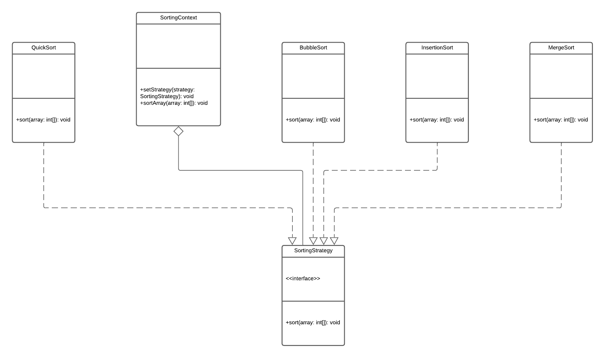
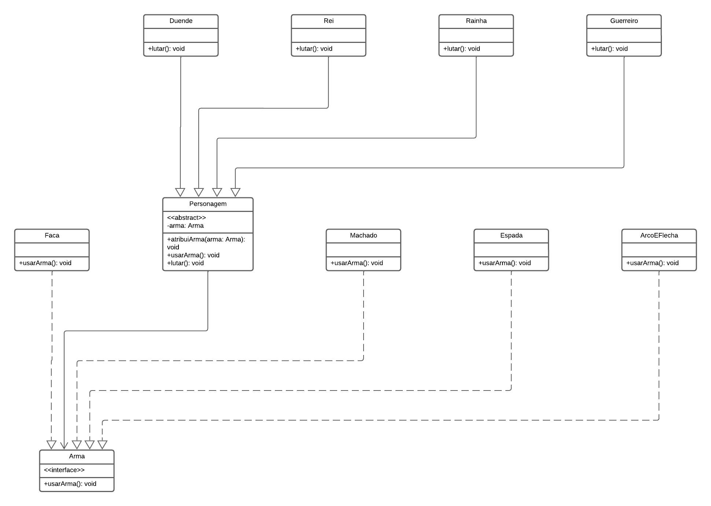

# Respostas Atividade Prática 01

## Design Patterns (Padrões de Projeto) - Strategy

### 1. Implementação do Padrão Strategy para Ordenação

#### Código:

```python
from abc import ABC, abstractmethod

class SortStrategy(ABC):
    @abstractmethod
    def sort(self, array):
        pass

class BubbleSort(SortStrategy):
    def sort(self, array):
        n = len(array)
        for i in range(n):
            for j in range(0, n-i-1):
                if array[j] > array[j+1]:
                    array[j], array[j+1] = array[j+1], array[j]
        print("BubbleSort:", array)

class InsertionSort(SortStrategy):
    def sort(self, array):
        for i in range(1, len(array)):
            key = array[i]
            j = i-1
            while j >= 0 and key < array[j]:
                array[j+1] = array[j]
                j -= 1
            array[j+1] = key
        print("InsertionSort:", array)

class MergeSort(SortStrategy):
    def sort(self, array):
        if len(array) > 1:
            mid = len(array) // 2
            L = array[:mid]
            R = array[mid:]

            self.sort(L)
            self.sort(R)

            i = j = k = 0
            while i < len(L) and j < len(R):
                if L[i] < R[j]:
                    array[k] = L[i]
                    i += 1
                else:
                    array[k] = R[j]
                    j += 1
                k += 1

            while i < len(L):
                array[k] = L[i]
                i += 1
                k += 1

            while j < len(R):
                array[k] = R[j]
                j += 1
                k += 1
        print("MergeSort:", array)

class QuickSort(SortStrategy):
    def sort(self, array):
        self.quick_sort(array, 0, len(array) - 1)
        print("QuickSort:", array)

    def quick_sort(self, array, low, high):
        if low < high:
            pi = self.partition(array, low, high)
            self.quick_sort(array, low, pi - 1)
            self.quick_sort(array, pi + 1, high)

    def partition(self, array, low, high):
        pivot = array[high]
        i = low - 1
        for j in range(low, high):
            if array[j] < pivot:
                i = i + 1
                array[i], array[j] = array[j], array[i]
        array[i + 1], array[high] = array[high], array[i + 1]
        return i + 1

class SortContext:
    def __init__(self, strategy: SortStrategy):
        self._strategy = strategy

    def set_strategy(self, strategy: SortStrategy):
        self._strategy = strategy

    def sort(self, array):
        self._strategy.sort(array)

if __name__ == "__main__":
    data = [64, 34, 25, 12, 22, 11, 90]

    context = SortContext(BubbleSort())
    context.sort(data.copy())

    context.set_strategy(InsertionSort())
    context.sort(data.copy())

    context.set_strategy(MergeSort())
    context.sort(data.copy())

    context.set_strategy(QuickSort())
    context.sort(data.copy())

```

#### Diagrama UML:



#

### 2. Implementação do Padrão Strategy com Personagens e Armas

#### Código:

```python
from abc import ABC, abstractmethod

class Arma(ABC):
    @abstractmethod
    def usar_arma(self):
        pass

class Machado(Arma):
    def usar_arma(self):
        print("Usando um machado.")

class Espada(Arma):
    def usar_arma(self):
        print("Usando uma espada.")

class ArcoEFlecha(Arma):
    def usar_arma(self):
        print("Usando arco e flecha.")

class Faca(Arma):
    def usar_arma(self):
        print("Usando uma faca.")

class Personagem(ABC):
    def __init__(self):
        self.arma = None

    def atribui_arma(self, arma: Arma):
        self.arma = arma

    def usar_arma(self):
        if self.arma is not None:
            self.arma.usar_arma()
        else:
            print("Nenhuma arma atribuída.")

    @abstractmethod
    def lutar(self):
        pass

class Rei(Personagem):
    def lutar(self):
        print("Rei está lutando.")

class Rainha(Personagem):
    def lutar(self):
        print("Rainha está lutando.")

class Guerreiro(Personagem):
    def lutar(self):
        print("Guerreiro está lutando.")

class Duende(Personagem):
    def lutar(self):
        print("Duende está lutando.")

def main():
    rei = Rei()
    rainha = Rainha()
    guerreiro = Guerreiro()
    duende = Duende()

    rei.atribui_arma(Espada())
    rainha.atribui_arma(Machado())
    guerreiro.atribui_arma(ArcoEFlecha())
    duende.atribui_arma(Faca())

    print("Ataques iniciais:")
    rei.lutar()
    rei.usar_arma()

    rainha.lutar()
    rainha.usar_arma()

    guerreiro.lutar()
    guerreiro.usar_arma()

    duende.lutar()
    duende.usar_arma()

    print("\nMudando armas:")
    rei.atribui_arma(Machado())
    guerreiro.atribui_arma(Faca())

    rei.lutar()
    rei.usar_arma()

    guerreiro.lutar()
    guerreiro.usar_arma()

if __name__ == "__main__":
    main()

```

#### Diagrama UML:


